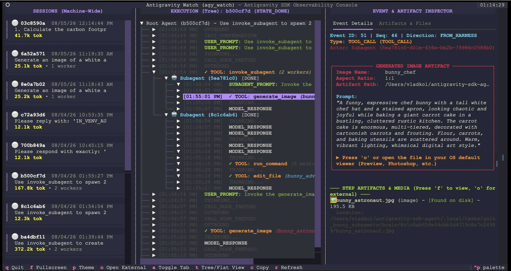

# 👀 agy_watch

**Antigravity SDK Observability Console**

[](https://www.python.org/)
[](https://textual.textualize.io/)
[](LICENSE)

## Welcome to agy_watch

The [Google Antigravity SDK](https://github.com/google-antigravity/antigravity-sdk-python) makes it fast and intuitive to build autonomous AI agents, multi-agent swarms, and tool-augmented workflows. Antigravity SDK exposes a Python interface paired under the hood with a high-performance Go runtime (`localharness`) that executes model reasoning, tool invocations, and subagent lifecycles at high speed.

**`agy_watch` provides deep, real-time observability into your Antigravity agents' inner execution loops.**

Whether you are debugging multi-agent coordination, inspecting subagent prompts, viewing Model Context Protocol (MCP) tools, or previewing generated code and media artifacts live, `agy_watch` lets you monitor the action directly from your terminal.



### Core Capabilities
1. **Zero-Code Agent Observability**: Monitor live agent execution without modifying a single line of your codebase. Hook into active virtual environments or standalone binaries with one command.
2. **Multi-Agent Swarm Tracking**: Visualize concurrent subagent workflows in a structured, hierarchical tree—tracking delegated instructions, worker reasoning, and nested tool calls in context.
3. **End-to-End Tool & Policy Inspection**: Inspect complete input arguments, execution outputs, runtime exceptions, and security policy interceptions for standard SDK tools, custom Python functions, and MCP servers.
4. **Live Workspace & Artifact Preview**: Review generated files, unified code diffs, markdown reports, and media assets in real time directly inside the terminal.
5. **Machine-Wide Discovery & Scriptable CLI**: Track all local agent sessions from a unified dashboard, or stream structured JSON events into terminal pipelines and evaluation scripts.

---

## Key Features

* **Hierarchical Execution Tree**: Automatically groups root agent and subagent lifecycles into collapsible branches, giving you immediate clarity on which agent performed which action.
* **First-Class Visualizers for Common Tools**: Dedicated, human-readable visualizers for shell commands (with exit codes), file edits (with syntax-colored unified diffs), image generation, interactive user questions, MCP servers, and custom Python callables.
* **Security Policy & Error Interception**: Clearly identifies blocked actions, policy denial reasons, and tool runtime exceptions with prominent diagnostic cards.
* **In-Terminal Artifact & Diff Viewer**: Instant syntax-highlighted previews for code, markdown, and images as soon as agents create or update them in their workspace.
* **Real-Time Live Streaming & Follow Mode**: Watch thoughts, streaming tokens, and execution steps render live as the model generates them, with auto-scroll and pause controls.
* **Non-Interactive CLI for Tooling**: Query past runs, tail active sessions, and inspect step payloads in JSON or YAML format for automated benchmarking and CI/CD pipelines.

---

## Installation

Install `agy_watch` into your Python virtual environment (Python 3.11 to 3.13):

```bash
# Using uv (Recommended)
uv add git+https://github.com/vladkol/agy_watch.git

# Or via standard pip
pip install git+https://github.com/vladkol/agy_watch.git
```

### Local Development Setup

```bash
# Clone repository
git clone https://github.com/vladkol/agy_watch.git
cd agy_watch

# Install dependencies and build editable environment
uv sync
```

---

## Global CLI Installation (Optional)

You can install `agy_watch` globally using `uv tool` or `pipx`:

```bash
# Install globally via uv tool
uv tool install git+https://github.com/vladkol/agy_watch.git

# Or into an active virtual environment
uv add git+https://github.com/vladkol/agy_watch.git
```

---

## Zero-Code Wire-Tapping

`agy_watch` provides multiple ways to observe your agents without changing a single line of your agent code:

### 1. In-Venv Auto-Observability (`agy_watch watch`) *(Recommended for Python)*

Enable auto-observability on your active virtualenv with one command:

```bash
# Watch the current virtual environment
agy_watch watch

# Or watch a specific project directory
agy_watch watch ./my_agent_project
```

Run your agents normally with `python`, `uv run`, `pytest`, or your IDE's Run button:
```bash
python my_agent.py
```
Every execution is automatically wire-tapped and indexed. To disable:
```bash
agy_watch unwatch
```

---

### 2. Universal Non-Python & Standalone Agents (`proxy-path`)

For non-Python agents (once they exist!) or standalone agents:

**Assuming they check `ANTIGRAVITY_HARNESS_PATH` as Python SDK does**:

```bash
# Run any agent through the universal harness proxy
ANTIGRAVITY_HARNESS_PATH="$(agy_watch proxy-path)" ./my-agent
```

---

### 3. On-Demand CLI Runner (`agy_watch run`)

Run any Python agent script on-demand with automatic proxy wire-tapping:

```bash
agy_watch run my_agent.py --arg1 value
```

---

## Interactive TUI Dashboard

Launch the interactive 3-pane dashboard:

```bash
agy_watch
```

### Layout Overview

```text
┌─────────────────────────┬───────────────────────────────┬───────────────────────────────┐
│ SESSIONS (Machine-Wide) │ EXECUTION TREE (Hierarchical) │ EVENT & ARTIFACT INSPECTOR    │
├─────────────────────────┼───────────────────────────────┼───────────────────────────────┤
│ 🟢 03c8590a 08/05/26    │ Root Agent Execution          │ [Event Details] [Artifacts]   │
│    Carbon Trip Planner  │  ├─ [12:14:44 PM] USER_PROMPT │ ───────────────────────────── │
│    41.7k tok            │  ├─ ▼ TOOL: calculate_carbon  │ ─── CUSTOM PYTHON TOOL ───────│
│ ─────────────────────── │  │   └─ [Done] 1.8 kg CO2     │ Function: calculate_carbon    │
│ ⚪ 6a52a571 08/05/26    │  ├─ ▼ MCP [everything:echo]   │ Arguments:                    │
│    Multimodal Image Run │  │   └─ [Done] Trip confirmed │   distance_km: 650            │
│    25.1k tok • 1 worker │  └─ [12:15:10 PM] MODEL_RESP  │   transport_mode: "train"     │
└─────────────────────────┴───────────────────────────────┴───────────────────────────────┘
```

### Keyboard Shortcuts

| Key | Action | Description |
| :--- | :--- | :--- |
| **`q`** | Quit | Exit the `agy_watch` console. |
| **`Space`** | Follow / Pause | Toggle auto-scrolling to follow the live event stream. |
| **`f`** or **`Enter`** | Fullscreen | Open the full-screen reader modal for the selected event, code, or markdown file. |
| **`c`** / **`Cmd+C`** / **`Alt+C`** / **`Ctrl+C`** | Copy Text | Copy highlighted text from active control or full event payload directly to OS clipboard. |
| **`a`** | Toggle Tab | Switch inspector pane between `Event Details` and `Artifacts & Files`. |
| **`t`** | Tree / Flat View | Toggle between Hierarchical Subagent Tree and Flat Chronological Stream. |
| **`s`** / **`p`** | Cycle Theme | Cycle through paired TUI and syntax highlighter color schemes (Dracula, Nord, Monokai, Tokyo Night, Gruvbox, Catppuccin). |
| **`o`** | Open External | Open selected media file in your OS default viewer (Preview, QuickLook, `xdg-open`). |
| **`w`** | Toggle Wrap | Toggle word wrapping inside the full-screen reader. |
| **`r`** | Refresh | Force immediate refresh of host sessions. |
| **`0`** | Filter All | Reset subagent filters and display all execution lanes. |

---

## CLI Commands (Scripting & Automation)

`agy_watch` provides non-interactive commands for scripting, terminal piping, and automated evaluation workflows:

### 1. List Sessions (`agy_watch list`)

```bash
# Formatted table with status icons and locale timestamps
agy_watch list

# Filter by live processes only
agy_watch list --status live

# JSON output for jq processing
agy_watch list --json

# YAML output
agy_watch list --yaml
```

### 2. Stream Live Events (`agy_watch tail`)

```bash
# Follow events in real time
agy_watch tail <session_id> --follow

# Stream events as structured JSON Lines (NDJSON)
agy_watch tail <session_id> --follow --json
```

### 3. Inspect Steps & Payloads (`agy_watch inspect`)

```bash
# Full summary and event list
agy_watch inspect <session_id>

# Inspect a specific step index in JSON format
agy_watch inspect <session_id> --step 3 --json
```

### 4. Direct TUI Attachment (`agy_watch attach`)

```bash
agy_watch attach <session_id>
```

---

> [!IMPORTANT]
> **Disclaimer**: `agy_watch` is a personal developer debugging and observability tool and is **NOT an official Google product or framework**. It is designed for testing, inspecting, and profiling autonomous agents built with [`google-antigravity==0.1.9`](https://pypi.org/project/google-antigravity/) and its bundled `localharness` binary.
> The tool is built by Antigravity itself by observing Antigravity SDK and localharness protocol.
> There is no guarantee for this tool to work prior or beyond this version.
> If any changes are required, you are welcome to file an issue and/or make a Pull Request.

---

## Architecture & Internals

For in-depth technical details on the WebSocket hook implementation, SQLite WAL synchronization, CAS blob offloading, MCP wire formats, and stream deduplication, see **[docs/INTERNALS.md](docs/INTERNALS.md)**.
